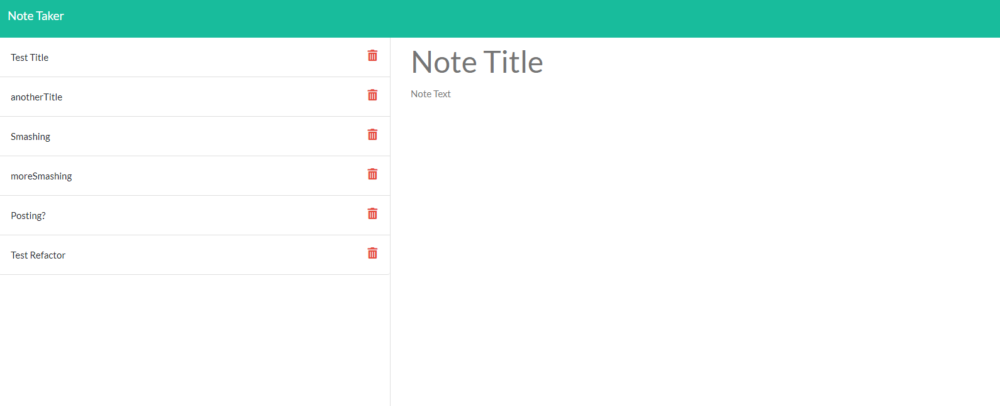

# NOTE TAKER

My name is Julian. Welcome to my NOTE TAKER node app.

## Description

this is a full stack app that let's you record and delete notes via a webpage

## Table of Contents

- [NOTE TAKER](#note-taker)
  - [Description](#description)
  - [Table of Contents](#table-of-contents)
  - [Language(s)](#languages)
  - [Installation](#installation)
  - [Usage](#usage)
  - [Contributing](#contributing)
  - [Tests](#tests)
  - [License](#license)
  - [Questions](#questions)
  - [Comments](#comments)

## Language(s)

Language(s) used in this project:
HTML,CSS,JavaScript

## Installation

> Firstly, you'll need to clone the repository. You can do that from the terminal with: `git@github.com:Calterat/express-note-taker`. `cd` into the cloned directory and `npm install`. This will install all packages required to run this app server. Now, `npm start` will start the server and you need to open your brower. The address will be `http://localhost:3001`. Enjoy!

## Usage

> You can either run it locally on your machine via the install steps, or you could run it in a Heroku app so you can access it from the web wherever you are! Carry your notes with you every where!

* 

## Contributing

> Help yourself to cloning the repo (SSH path in the install steps), branch, and push with a merge request!
 

## Tests

> To test the few functions in the back end, in your terminal type `npm test` while in the app directory.

## License

This project is covered under the license of [MIT License](https://GitHub.com/Calterat/express-note-taker/blob/main/LICENSE.txt)

## Questions

You can find my repository URL [Here](https://GitHub.com/Calterat)

* Here is the link to the site URL: [https://julians-express-note-taker.herokuapp.com/](https://julians-express-note-taker.herokuapp.com/)
         

If you have additional questions, you may reach me at my E-mail Address: calterat@gmail.com

## Comments

> This README is made with another one of my apps! the README Generator!

